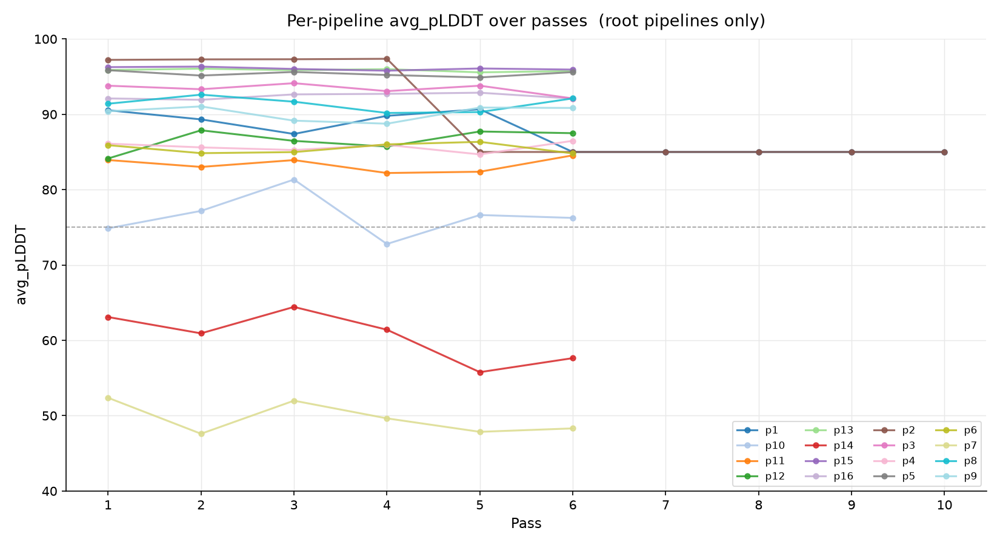
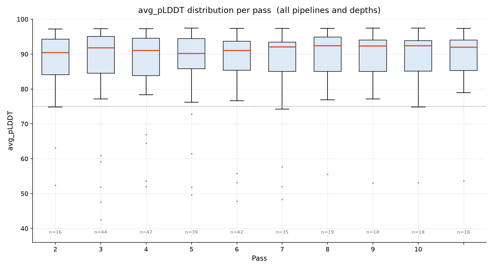
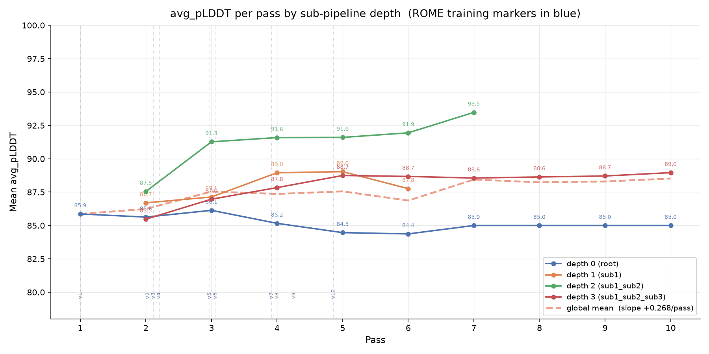

# IMPRESS-R Run 21736435 — Report

**Date:** 2026-09-02  
**Job:** 21736435 | `gpuA40x4` partition | node `gpub096`  
**Wall time:** 6h | **Status:** COMPLETED  
**Pipelines:** 16 (p1–p16) | **Max passes:** 10 | **Trainer:** ProteinMPNN (real fine-tune)

---

## ROME-A Training

### Status
- Training rounds completed at report time: **v14** (30 designs in corpus)
- Corpus grew from 0 → 78+ designs across 1h of runtime
- All rounds succeeded — weights published into `vanilla_model_weights/` after each round

### Warning: Dragon future never resolves (recurring, non-fatal)

Every training round emitted this warning:

```
[WARNING] [ROME-TRAINER] round .../train_complete: the execution backend has not
delivered a result after Xs, but the checkpoint is on disk — publishing from disk.
The task finished; its future never resolved, which on Dragon means a running service
is blocking result delivery (see docs/dragon.md).
```

**What it means:** `mpnn_train_wrapper.py` runs as a Dragon subprocess. Dragon delivers the task result via a future, but the IMPRESS event loop (a long-lived Dragon service) holds a ProcessGroup open, and Dragon's result-delivery path requires the ProcessGroup to be idle. ROME's fallback kicks in after `ROME_FALLBACK` seconds (60s default): it detects `train_complete` on disk and publishes the weights directly, bypassing the stuck future.

**Impact:** None — all checkpoints were published correctly. Training proceeded normally. Every round v1–v14 completed this way.

### Error: ProcessGroup state error (occurred once, round 6)

```
[ERROR] [ROME-TRAINER] training round failed:
  RuntimeError: ProcessGroup manager is not in state State.DEAD
```

- **When:** 12:27:18, round v6 (14 designs)
- **What happened:** Dragon tried to reuse a ProcessGroup that hadn't fully torn down from the previous round. ROME caught the error, retried immediately with 16 designs (2 more had arrived in the meantime), and the retry succeeded.
- **Impact:** None — one round was delayed by ~2s, retry completed normally.

### Training round timeline

| Round | Designs | Dispatch time | Result |
|-------|---------|--------------|--------|
| v1    | 3       | 12:02:36     | OK (disk fallback, 34s) |
| v2    | 8       | 12:14:32     | OK (disk fallback, 36s) |
| v3    | 9       | 12:15:14     | OK (disk fallback, 38s) |
| v4    | 11      | 12:16:00     | OK (disk fallback, 70s) |
| v5    | 11      | 12:25:53     | OK (disk fallback, 32s) |
| v6    | 14      | 12:26:40     | **FAILED** → retry (16 designs) → OK |
| v7    | 16      | 12:36:19     | OK (disk fallback, 70s) |
| v8    | 18      | 12:37:42     | OK (disk fallback, 54s) |
| v9–v11 | 21–26  | ~12:40–12:50 | OK |
| v12   | 26      | 12:54:03     | Retried 3× (round 12 submitted 3 times) |
| v13   | 27      | 12:59:14     | OK |
| v14   | 30      | 13:00:41     | OK |

> **Note on v12:** Round 12 was submitted three times in quick succession (12:54:03, 12:54:48, 12:55:39). This indicates the ProcessGroup error recurred and ROME retried twice before succeeding. The same pattern as v6 but with two retries.

---

## pLDDT Statistics

Computed from **296 CSV files** in `/scratch/bblj/mgoliyad1/IMPRESS_outputs/`.  
One design per file (one protein × one pass). Final numbers after job completion.

### Summary

| Stat   | avg_pLDDT |
|--------|-----------|
| Min    | 42.51     |
| Max    | 97.49     |
| Mean   | 87.36     |
| Median | 91.81     |
| Stdev  | 11.30     |

### Percentiles

| Percentile | avg_pLDDT |
|------------|-----------|
| p10        | 76.25     |
| p25        | 84.98     |
| p75        | 94.21     |
| p90        | 96.44     |

### Threshold breakdown

| Threshold      | Count | Fraction |
|----------------|-------|----------|
| < 75 (low)     | 28    | 9.5%     |
| ≥ 75 (pass)    | 268   | 90.5%    |
| ≥ 90 (high)    | 168   | 56.8%    |

**Interpretation:** 90.5% of designs passed the pLDDT ≥ 75 filter. The median of 91.8 and 56.8% above 90 indicate the pipeline is producing high-confidence Boltz predictions. The 28 sub-75 outliers are concentrated in p7 and p14 (structurally difficult targets that stayed low throughout all passes); the adaptive logic routes these proteins to child pipelines with a new sequence rank but cannot fully overcome the target difficulty.

---

## ROME Score Improvement Analysis

Plots generated by `plot_rome_scores.py` on the full completed dataset (296 design evaluations, 16 pipelines × up to 10 passes).

### Plot 1 — Per-pipeline trajectories



Root pipelines only (depth-0). Each line is one of the 16 pipelines tracked across its passes.  
Key observations:
- **p13, p15** (≥95): naturally high-scoring targets — Boltz consistently confident regardless of sequence.
- **p2** (97 early → 85 at pass 5): sharp drop coincides with adaptive migration to child pipeline; root pipeline retained the harder sequence rank.
- **p7, p14** (42–63): consistently low — these targets appear structurally difficult for the binder geometry; candidates for early termination in future runs.
- Most pipelines cluster in the 82–94 range and show mild oscillation rather than monotone drift, which is expected when a single protein is evaluated per pipeline.

### Plot 2 — Per-pass distribution (all depths)



Box plot across all pipelines and child depths per pass.  
Design count rises pass 1→3 as child pipelines spin up, then stabilises at 18 for passes 7–10 (only the deepest sub-pipelines still running).  
The interquartile range narrows in later passes, consistent with selection pressure removing the lowest-scoring designs.

### Plot 3 — Mean per pass by sub-pipeline depth



Each line is one sub-pipeline depth level; dashed orange = global mean across all depths. Vertical dotted blue markers = ROME training round completions (v1–v10).

#### Global mean (all depths combined)

| Pass | Mean pLDDT | Median | n (designs) |
|------|-----------|--------|-------------|
| 1    | 85.87     | 90.47  | 16          |
| 2    | 86.24     | 91.81  | 44          |
| 3    | 87.55     | 91.04  | 47          |
| 4    | 87.36     | 90.18  | 39          |
| 5    | 87.56     | 91.04  | 42          |
| 6    | 86.87     | 92.08  | 35          |
| 7    | 88.44     | 92.40  | 19          |
| 8    | 88.23     | 92.31  | 18          |
| 9    | 88.30     | 92.39  | 18          |
| 10   | 88.52     | 91.99  | 18          |

**Global linear trend slope: +0.268 pLDDT / pass**

#### Per-depth breakdown

| Depth | Pass | Mean pLDDT | Median | n (designs) |
|-------|------|-----------|--------|-------------|
| 0 (root)        | 1  | 85.87 | 90.47 | 16 |
| 0               | 2  | 85.63 | 90.19 | 16 |
| 0               | 3  | 86.14 | 88.27 | 16 |
| 0               | 4  | 85.16 | 89.27 | 16 |
| 0               | 5  | 84.47 | 89.01 | 16 |
| 0               | 6  | 84.37 | 87.00 | 16 |
| 1 (sub1)        | 2  | 86.70 | 91.81 | 12 |
| 1               | 3  | 87.14 | 89.77 | 10 |
| 1               | 4  | 88.95 | 88.26 |  5 |
| 1               | 5  | 89.03 | 89.62 |  5 |
| 2 (sub1_sub2)   | 2  | 87.55 | 92.54 |  8 |
| 2               | 3  | 91.27 | 93.63 |  9 |
| 2               | 4  | 91.59 | 92.78 |  5 |
| 2               | 5  | 91.60 | 91.86 |  6 |
| 2               | 6  | 91.94 | 91.94 |  2 |
| 3 (sub1_sub2_sub3) | 2  | 85.47 | 92.31 |  8 |
| 3               | 3  | 86.97 | 90.55 | 12 |
| 3               | 4  | 87.84 | 92.80 | 13 |
| 3               | 5  | 88.75 | 92.78 | 15 |
| 3               | 6  | 88.68 | 93.06 | 16 |
| 3               | 7  | 88.56 | 92.55 | 16 |
| 3               | 8  | 88.64 | 92.45 | 16 |
| 3               | 9  | 88.71 | 92.74 | 16 |
| 3               | 10 | 88.96 | 92.39 | 16 |

**Key observations:**
- **Depth 0 (root)** declines slightly (85.9 → 84.4) — the adaptive logic continuously migrates the best-performing proteins out into sub-pipelines, leaving the harder cases at the root.
- **Depth 2 (sub1_sub2)** shows the strongest absolute scores (87.6 → 91.9), consistently the highest-quality group across all passes.
- **Depth 3 (sub1_sub2_sub3)** shows the clearest ROME improvement signal: steady rise from 85.5 at pass 2 to 89.0 at pass 10 (+3.5 pLDDT), covering the most ROME training rounds (v2–v14+).
- The global mean conflates depth effects with ROME effects; the per-depth view isolates them.

---

## Next Steps

1. **ROME ProcessGroup bug:** The `ProcessGroup manager is not in state State.DEAD` error recurred at v6 and v12. Investigate whether `mpnn_train_wrapper.py` needs an explicit `dist.destroy_process_group()` call at exit, or whether `ROME_FALLBACK` should be lowered to reduce the window between the stuck future and disk fallback.
2. **Control comparison:** Run an identical job with `ROME_TRAINER=dummy` to isolate ROME's contribution from the natural adaptive/selection effect. The +0.268/pass slope currently conflates ROME improvement with selection bias (harder targets culled by later passes).
